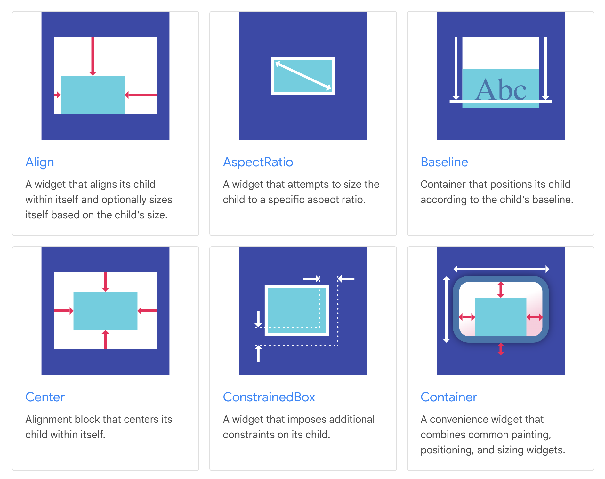
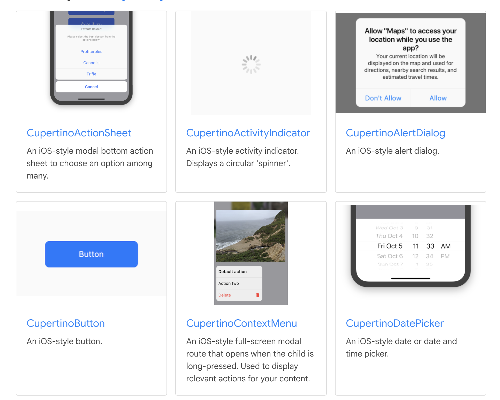
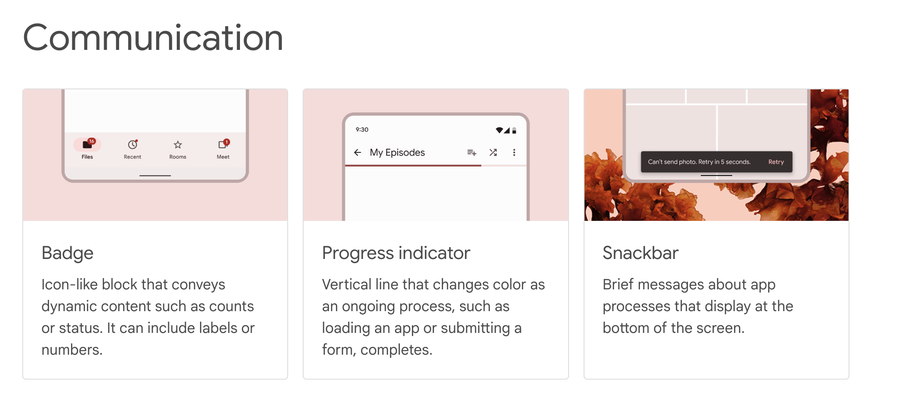

# Flutter Widgets

플러터 앱을 구성하는 기본 컴포넌트는 위젯 (Widget) 이다.
위젯은 리액트의 컴포넌트와 비슷하게 현재 위젯의 상태 (State)에 따라 View가 어떻게 표현될지에 대한 정보를 담고 있다.

위젯의 구분은 두가지 측면에서 할 수 있는데, UI상에 어떻게 나타나는 지와 State를 가지고 관리하는 위젯인지, 아닌지로 구분할 수 있겠다.

## 플러터가 제공하는 다양한 위젯의 종류

기본적으로 위젯은 UI 컴포넌트라고 보면 된다.

각 위젯들은 추후의 설명할 StateFull Widget 혹은 Stateless Widget의 자식 클래스로서, 각각의 기능을 가지는데
플러터에서 제공하는 기본 위젯들은 이를 기반으로 다양한 UI 기능을 제공한다. (사실 UI가 아닌 기능들도 제공한다.)

이러한 위젯들은 [위젯 카탈로그](https://docs.flutter.dev/ui/widgets)를 통해서 확인할 수 있다.

몇 가지 예시를 들어 보자면,

### Text

> 텍스트를 보여주는 위젯

### Layout

> 레이아웃을 관리하는 위젯



사실 웹 개발을 할 때는 단순히 `<div/>` 태그에 `display` 속성을 주어서 개발할 수 있었는데, 플러터에서는 이러한 기능들을 갖춘 위젯들을 조합하여 사용하는 형태로 개발하게 된다.

### Cupertino & Material Design Widgets




이 외에도 다양한 위젯들 (애니메이션을 위한 위젯, 접근성을 위한 위젯...)들을 제공하고 있다.
어떻게 보면 이러한 위젯들을 명시적으로 제공함으로서 `React Hook`을 통해 이러한 기능들을 사용하는 리액트보다 좀 더 처음에 접근하기 쉬운 점은 있을 것 같다는 생각이 든다.

하지만 한편으로는 각 컴포넌트 안에 또 다른 컴포넌트들의 클래스 형태에서 계속 정의되는 과정이 함수형 컴포넌트에 훅을 다는 형태로 개발해온 사람에게 좀 어색하지 않을까 하는 걱정도 되는데, 이것 관련해서는 좀 더 플러터 개발을 해본 이후에 작성해보도록 하겠다.

## Stateful Widget, Stateless Widget

플러터의 위젯은 Stateful Widget 혹은 Stateless Widget으로 나눌 수 있다.

Stateful Widget과 Stateless Widget 모두 `build` 메서드를 구현하는 것을 필요로 한다.

### Stateless Widget

Stateless Widget은 말 그대로 Stateless한, 내부에 유지할 상태가 없는 위젯이다.

이 위젯은 단순히 외부에서 주어지는 configuration (파라미터(?\_))

```dart
class TitleText extends StatelessWidget {
  final String text;

  TitleText(this.text);

  @override
  Widget build(BuildContext context) {
    return Center(
      child: Text(text)
    );
  }
}
```

### Stateful Widget

리액트의 Class Component와 유사한 모습이다.

```dart
class Counter extends StatefulWidget {
  Counter({Key key, this.title}) : super(key: key);

  // Widget 내부에서 관리할 State를 생성한다
  @override
  _MyHomePageState createState() => new _MyHomePageState();

}

class _MyHomePageState extends State<MyHomePage> {

  // State
  int counter = 0;

  void increaseCount() {
    // React의 SetState와 유사
    setState(() {
        this.counter++;
    }
  }

	// 빌드 메서드가 여기에 선언된다
  Widget build(context) {
    return new RaisedButton(
        onPressed: increaseCount,
      child: new Text('Tap to Increase'),
    );
  }
}
```
